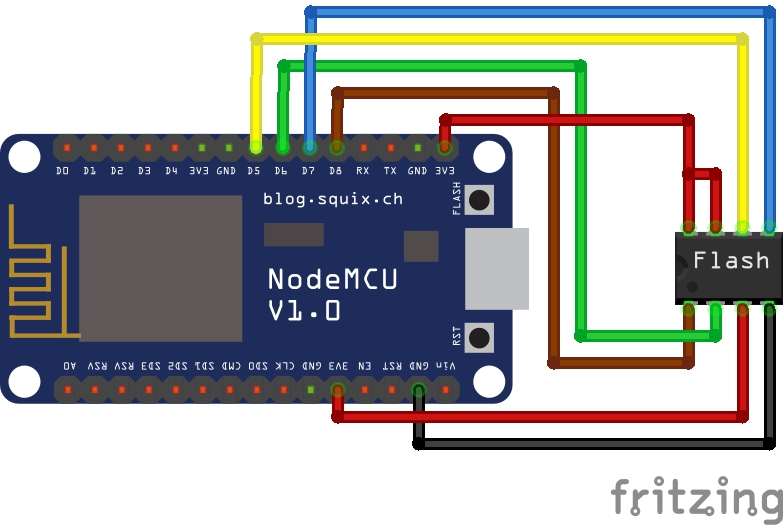
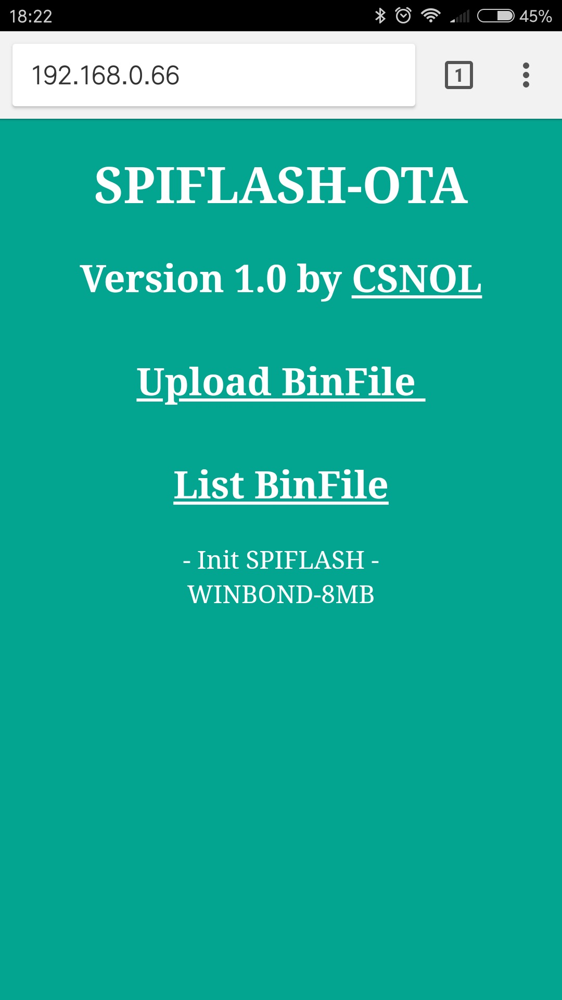
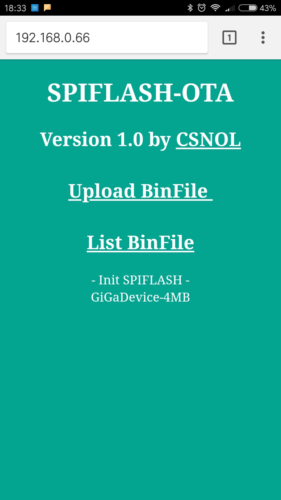
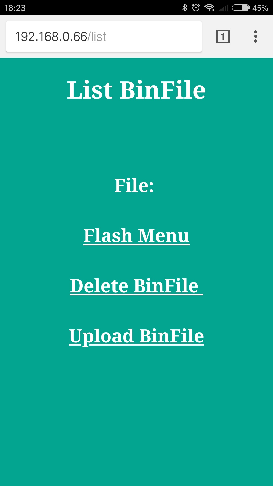
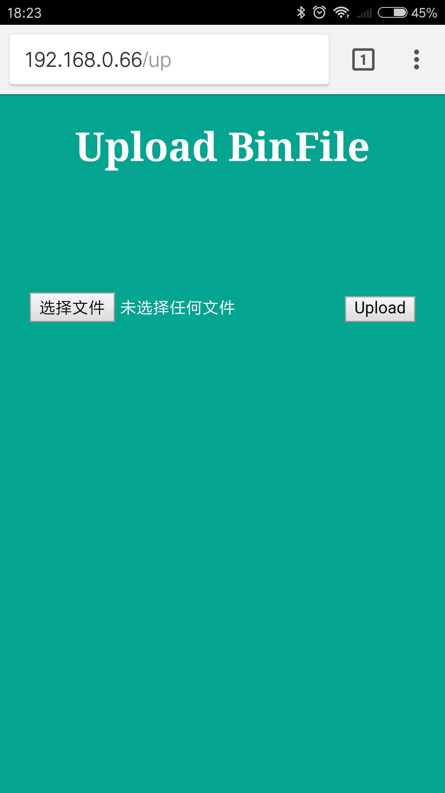
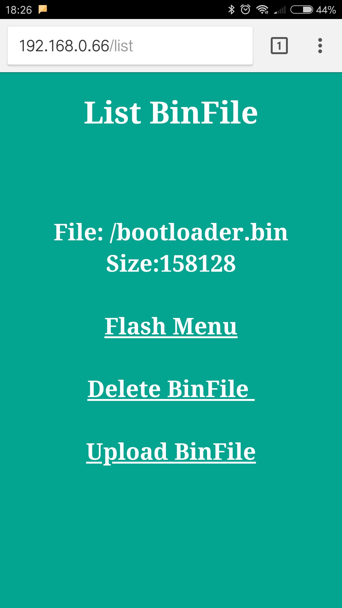
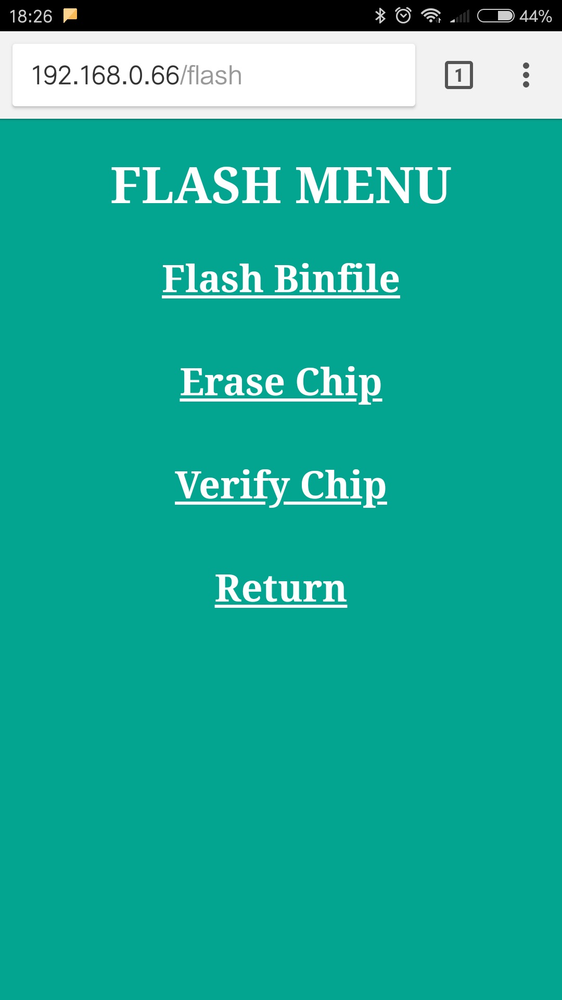
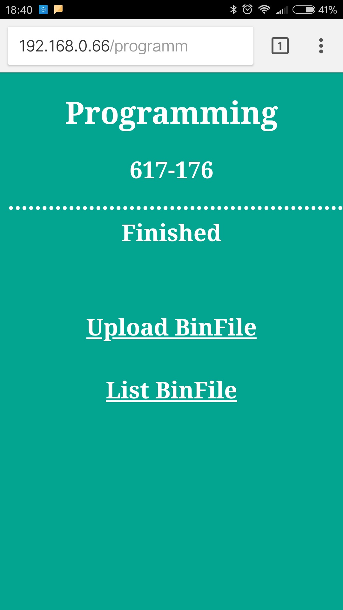
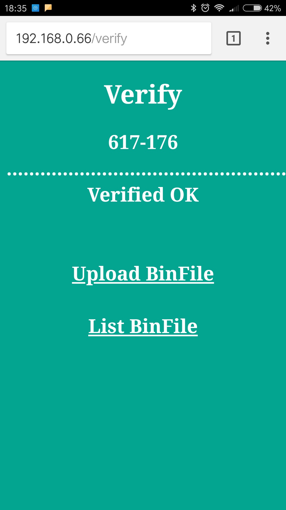

# SPIFLASH-OTA
SPI FLASH OTA by ESP8266 in Arduino IDE

----
#### TESTED on: W25Q64, GD25Q32C

|If use ESP8266 Pin |SPIFLASH  |if use NodeMCU Pin |
| :-----: |:-----:| :-----:|
|15|/CS-Pin1|D8|
|14|CLK-Pin6|D5|
|13|DI-Pin5|D7|
|12|DO-Pin2|D6|
|Vcc|Vcc-Pin8|3.3V|
|Vcc|/HOLD-pin7|3.3V|
|Vcc|/WP-pin3|3.3V|
|GND|GND-pin4|GND|
---

#### 1. Use NODEMCU 
 

---

#### 2. Webpages Screenshot  
######   ---   ---  
---

######   ---   ---  

---
######   ---   ---  

#### 3. TODO
###### 1>  More quickly to Erase and Flash
###### 2>  More chips supported
###### 3>  Share data with STM32 series MCU

######  
